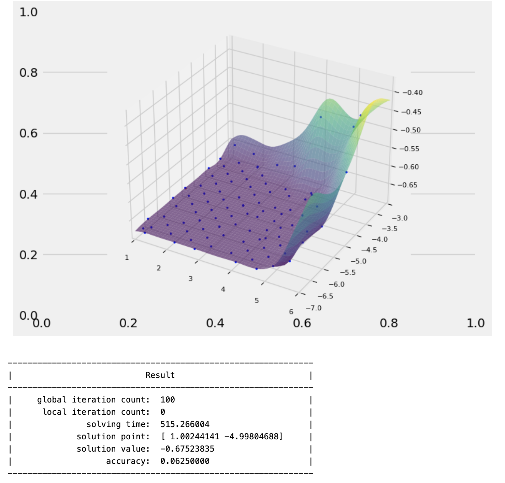
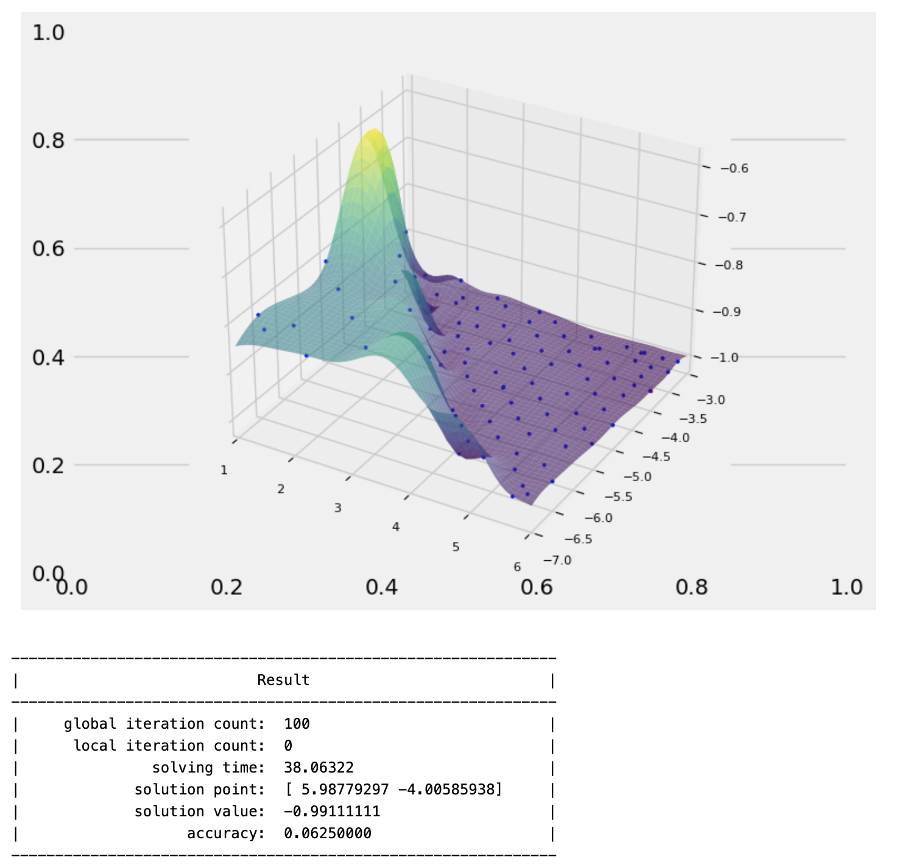

# Задание 17
**ноутбук с работой** - [task11](https://github.com/alkomarova/math_modeling/blob/task17/task17.ipynb)
### Цель:
Использовать одну из библиотек, представленных на курсе "Фронтиры прикладного искусственного интеллекта: промышленность, экономика, образование-2023" для решения финансовой задачи.

### Ход работы: 
В качестве исследуемой библиотеки был выбрал фреймворк для поиска оптимальных значений параметров функций
[iOpt](https://github.com/aimclub/iOpt/tree/main), предоставляющий возможность автоматизировать подбор гиперпараметров для моделей машинного обучения. 
Для исследования также было выбрано две задачи: предсказание направления движения стоимости акций компании ebay с использованием технических индикаторов[stocks.ipynb](https://github.com/alkomarova/math_modeling/blob/task17/stocks.ipynb) и задача кредитного скоринга [credit.ipynb](https://github.com/alkomarova/math_modeling/blob/task17/credit.ipynb)
В обеих задачах использовался классификатор SVC, для которого было необходимо подобрать оптимальные значения гиперпараметров: С(regularization parameter) и gamma(kernel coefficient).

### Результаты работы:

Задача предсказания движения цен: 
| Параметры | F-1 | 
|----------|----------|
| Стандартные   | 0.982  | 
| Оптимальные   | 0.991   | 

Задача кредитного скоринга:
| Параметры | F-1 | 
|----------|----------|
| Стандартные   | 0.458  | 
| Оптимальные   | 0.675   | 

### Заключение: 
В результате работы была протестирована библиотека iOpt для поиска оптимальных параметров моделей в задачах кредитного скоринга и предсказания направления движения цены акций. 