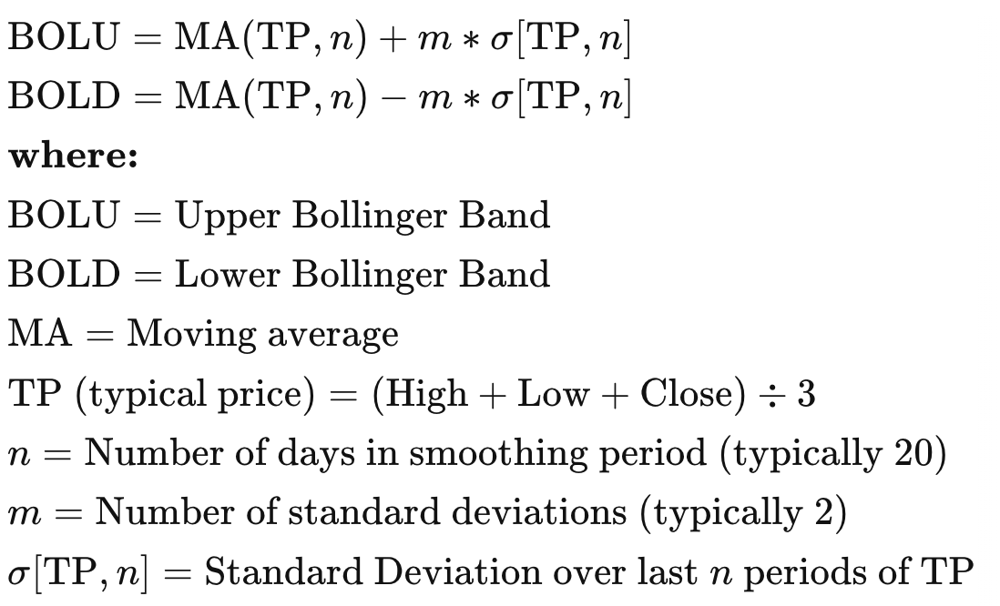

# Задание 2

### Выработка рекомендаций поведений трейдера на основе паттернов и индикаторов

1. Выбрать исследуемый технический индикатор 
2. Реализовать алгоритм предсказания цен на акции компаний в зависимости от значения выбранного технического индикатора

В ходе работы был выбрал технический индикатор - *Bollinger Bands*, который рассчитывается
следующим образом: 

В результате работы:
1. Был реализован алгоритм предсказания значения цены акции компании "EBAY" на основе
значений технического индикатора с помощью линейной регрессии
2. Были подобраны оптимальные параметры для коэффициентов в формулах для расчета 
Upper/Lower Bollinger Bands
3. Была показана зависимость значения ошибки модели от количества дней, для которых
строятся предсказания