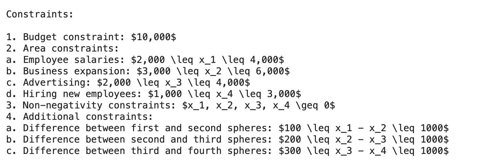
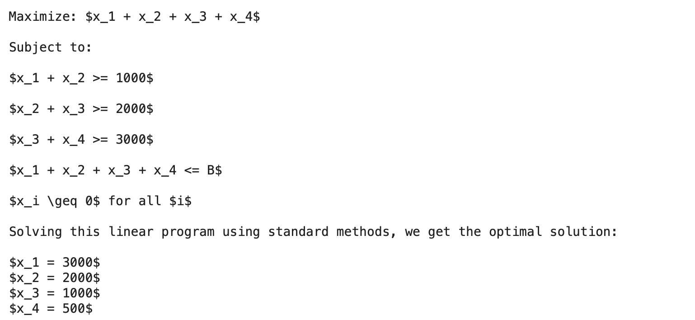

# Задание 3
**ноутбук с работой** - [task3](https://github.com/alkomarova/math_modeling/blob/task3/task3.ipynb)
### Цель:
Реализация симплекс-метода

### Задачи: 
1. Сформулировать задачу линейного программирования
2. Записать математическую формулировку задачи
3. Реализовать симплекс-метод

### Формулировка задачи: 
Пусть у фирмы есть бюджет 10000$, также существует 4 сферы, в которые можно вложить деньги.
Первая сфера - зарплата сотрудникам, вторая - расширение бизнеса, третья - реклама,
четвертая - найм новых сотрудников. В этом месяце необходимо максимально профинансировать
первую и вторую сферы. При этом есть некоторые дополнительные условия: разница между первой
и второй сферой должна быть >= 100$, между второй и третьей >= 200$, а между третьей и 
четвертой >= 300$.

*Задача в математическом виде:*

$$x_1+x_2 -> max$$

$$\begin{cases}
1x_1 + 1x_2 + 1x_3 + 1x_4 = 10000 \\
1x_1 - 1x_2 >= 100 \\
1x_2 - 1x_3 >= 200 \\
1x_3 - 1x_4 >= 300 \\
\end{cases}$$

### Результаты работы: 
В результате работы удалось реализовать алгоритм симплекс-метода.
Оптимальные значения переменных: $$x_1 = 9200, x_2 = 500, x_3 = 300, x_4 = 0$$

Максимальное значение функций: $$F = 9700$$

В качестве языковой модели для формулировки математической постановки задачи была
использована модель Llama, разработанная компанией Microsoft. Модель можно загрузить с помощью
API сайта huggingface, однако перед загрузкой необходимо получить два подтверждения  
от самого сайта и от microsoft(что может быть затруднено, так как подтверждения не
приходят на российские номера). Также ноутбук [Llama.ipynb](https://github.com/alkomarova/math_modeling/blob/task3/Llama.ipynb)
нужно запускать там, где есть возможность использовать GPU(например в коллабе), так
как с CPU у модели проблемы.

Модели были переданы два промта(на английском и на русском языках),
предлагающие записать математическую формулировку вышеописанной задачи.

На англоязычный промт модель сгенерировала следующую "формулировку":

В первом варианте модель придумала свои условия на некоторые переменные и запись в математическом виде выглядит 
не очень визуально привлекательно. 

На русскоязычный:

Второй вариант визуально более похож на правду, однако модель снова ошиблась в ограничениях и неправильно была сформулирована целевая функция. 
Также сгенерированные результаты не соответствуют действительности, однако, возможно, что для более легкой
задачи математическая постановка была бы точнее. 
### Заключение: 
В результате работы удалось реализовать алгоритм симплекс-метода, а также попробовать
использовать языковые модели для формулировки математической постановки задачи. 