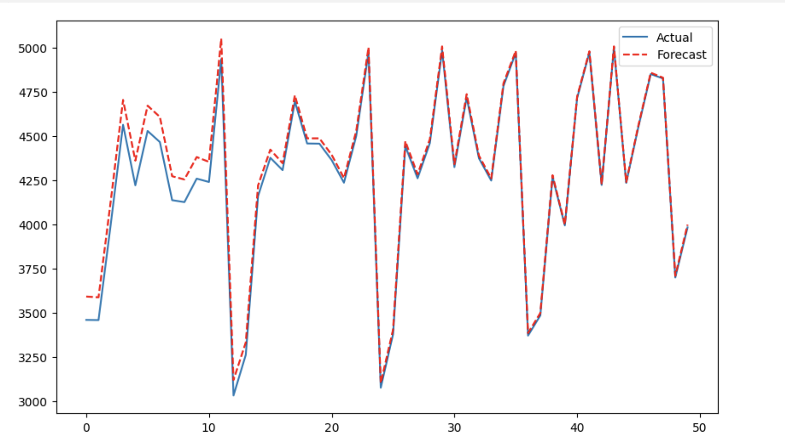

# Задание 5
**ноутбук с работой** - [task5](https://github.com/alkomarova/math_modeling/blob/task5/task5.ipynb)
### Цель:
Реализация модели Хольта-Винтерса

### Задачи: 
1. Сформулировать модель Хольта-Винтерса
2. Подобрать оптимальные гиперпараметры

### Формулировка задачи: 
Модель Хольта-Уинтерса с аддитивной сезонностью представляет
собой метод прогнозирования временных рядов, который учитывает тренд,
уровень и сезонные колебания в данных. Основные компоненты модели включают
в себя уровень (текущее значение уровня ряда), тренд (темп изменения уровня)
и сезонность (циклические колебания с фиксированным периодом).

1. **Уровень (Level):**
   $\ L_t = \alpha \cdot (y_t - S_{t-m}) + (1 - \alpha) \cdot (L_{t-1} + T_{t-1}) \$

2. **Тренд (Trend):**
   $\ T_t = \beta \cdot (L_t - L_{t-1}) + (1 - \beta) \cdot T_{t-1} \$

3. **Сезонность (Seasonality):**
   $\ S_t = \gamma \cdot (y_t - L_t) + (1 - \gamma) \cdot S_{t-m} \$
   где $\( m \)$ - период сезонности (например, для ежемесячных данных с месячной сезонностью $\( m = 12 \)$.

### Результаты работы: 
Пример прогнозирования ежемесячных объемов продажи алкоголя с помощью реализованной модели
:

### Заключение: 
В результате работы удалось реализовать модели Хольта-Винтерса и подобрать оптимальные гиперпараметры.
