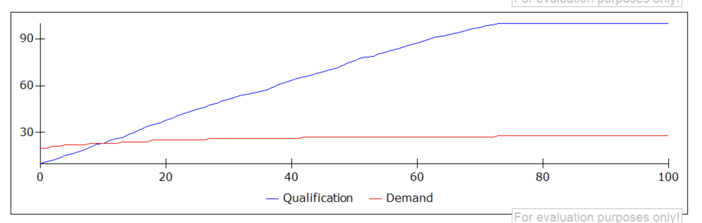

# Задание 2
**ноутбук с работой** - [task4](https://github.com/alkomarova/math_modeling/blob/task4/task4.ipynb)
### Цель:
Знакомство с системно-динамическим программированием

### Задачи: 
1. Добавить в модель новый уровень
2. Реализовать модель на python

### Результаты работы:
В модель был добавлен новый уровень - квалификация сотрудников Q. В качестве начальной квалификации было
выбрано значение 10, максимальное значение уровня квалификации - 100. Уровень квалификации повышается в
зависимости от процента денежных средств, выделенных из бюджета на обучение сотрудников. 

График модели: 

График изменения уровня квалификации и спроса в Powersim:

График изменения уровня квалификации и спроса в Python:

### Заключение: 
В результате работы удалось добавить уровень квалификации в модель и реализовать
работу модели на python.
